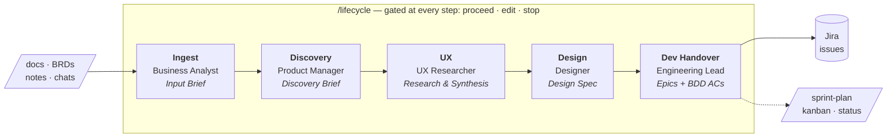

# agile-product-agent

> From a messy BRD to dev-ready, BDD-tested stories — one gated pipeline, each stage handled by the right hat.


A Claude Code plugin for agile product workflows. It threads the whole product flow — **ingest → discovery → UX → design → dev handover** — into a single guided pipeline, then adds sprint planning, grooming, kanban, status, and retros on top. Works against Jira and Confluence via the official Atlassian MCP server, or **fully offline** against local `workspace/` files when no connection is configured.

## How it works



Each stage is owned by the persona that naturally does that work, produces **one canonical artifact** in that persona's format, and pauses for your review before the next stage begins.

| Stage | Persona | Standard | Artifact |
|-------|---------|----------|----------|
| Ingest (docs, BRDs, notes, chats) | Business Analyst | `requirements.md` | Input Brief — sources + candidate requirements |
| Discovery | Product Manager | `confluence.md` (Spec/PRD) | Discovery Brief — problem, goals, opportunities |
| UX | UX Researcher | `ux.md` | UX Research & Synthesis — personas, journeys, findings |
| Design | Designer | `design.md` | Design Spec — all states + accessibility + handoff |
| Dev Handover | Engineering Lead | `jira.md`, `bdd.md` | Epics/stories with BDD ACs + DoR check → Jira issues |

- **Context carries forward.** Every artifact opens with a **Carried Context** header (upstream links, inherited problem, decisions, open questions) — so the next persona always has the thread. No document is written in isolation.
- **One source of truth per initiative.** A **Lifecycle Index** page tracks stage status and the full traceability chain: source/BRD → requirement IDs → discovery → UX → design → Jira stories.
- **Run it whole or by stage.** `/lifecycle` walks all five stages and resumes mid-flow (`/lifecycle ux`); or run a single stage standalone with `/ingest`, `/discover`, `/ux`, `/design`, `/handover`. Delivery (`/sprint-plan`, `/kanban`) picks up after handover.
- **Nothing is written without confirmation** — the same human-in-the-loop gating as `/ingest` and `/sync`.

See `standards/lifecycle.md` for the stage map, Carried Context header, and Lifecycle Index format.

## See it work

You start with a one-line BRD and a thread of meeting notes:

> *"Guests abandon checkout when forced to create an account. We need guest checkout before Black Friday."*

Run `/lifecycle`. Five gated stages later, you have a linked paper trail:

| Stage | What lands |
|-------|-----------|
| **Ingest** (BA) | Input Brief: `REQ-1` guest checkout, `REQ-2` post-purchase account prompt — each traced to the BRD |
| **Discovery** (PM) | Discovery Brief: problem, goals, success metric (checkout completion `+X%`), non-goals |
| **UX** (UX Researcher) | Personas + a journey map pinpointing the account-wall drop-off, every finding evidence-backed |
| **Design** (Designer) | Design Spec covering every state (empty / loading / error / success) with an accessibility checklist |
| **Dev Handover** (Eng Lead) | Epic + stories with Given/When/Then ACs, Definition-of-Ready checked, written to Jira |

Each artifact links back to the one before it, and the Lifecycle Index threads the whole chain end to end.

## Installation

Install it as a Claude Code plugin from the GitHub marketplace:

```text
/plugin marketplace add joaroo/agile-product-agent
/plugin install agile-product-agent@joaroo
```

Then run `/reload-plugins` (or restart Claude Code). All 14 commands (`/lifecycle`, `/ingest`, `/discover`, …) and their skills load automatically.

### Local development

Working from a clone of this repo? Register it as a local marketplace in `.claude/settings.json` at your project root:

```json
{
  "extraKnownMarketplaces": {
    "joaroo": {
      "source": {
        "source": "directory",
        "path": "/absolute/path/to/agile-product-agent"
      }
    }
  },
  "enabledPlugins": {
    "agile-product-agent@joaroo": true
  }
}
```

This file is git-ignored (it holds a machine-specific path). Reload plugins to pick up your edits.

### (Optional) Connect Atlassian

By default everything runs offline (see **Local fallback** below). To work against live Jira + Confluence:

1. Copy `.mcp.json.example` to `.mcp.json`, then choose a connection method:
   - **Hosted Rovo MCP server** (no local install, browser OAuth) — the default in the example file
   - **Local stdio package** (`npx @atlassian/mcp-server`)

   Both expose the same tools — see `connectors/atlassian/CONNECTOR.md` for the exact configs.
2. Run `claude` — it prompts for Atlassian OAuth on first tool use
3. Fill in your Jira project keys and Confluence space IDs in `connectors/atlassian/CONNECTOR.md`
4. (Optional) Set `EMAIL_MCP_TOOL` in `.env` to enable `/ingest` from email

### Local fallback

No `.mcp.json`? No problem. When `mcp__atlassian__*` tools are unavailable, the agent automatically reads and writes local markdown files under `workspace/jira/` and `workspace/confluence/`, mirroring the Jira/Confluence object model. **All commands work end-to-end with zero external setup.**

- `workspace/` is git-ignored and treated as private product data
- See `connectors/local/CONNECTOR.md` for activation, layout, and validation steps
- See `standards/local-store.md` for file formats and JQL/CQL translation
- Worked offline first? Run `/sync` once Atlassian is connected to push `workspace/` up.

## Commands

| Command | Description |
|---------|-------------|
| `/as [role]` | Set active persona to adapt output tone and structure |
| `/lifecycle` | Run the end-to-end flow: ingest → discovery → UX → design → dev handover, gated per stage |
| `/ingest` | Parse docs, BRDs, meeting notes, or email into Jira issues / Confluence pages |
| `/discover` | Product discovery from Jira + Confluence |
| `/ux` | Synthesise discovery + research into UX artifacts (personas, journey map, JTBD, findings) |
| `/design` | Turn UX + discovery into a Design Spec (all states, accessibility, handoff) |
| `/handover` | Decompose into epics/stories with BDD ACs + a Definition-of-Ready check |
| `/update-docs` | Create or update Confluence pages |
| `/sync` | Push local `workspace/` up to Jira and Confluence (requires live Atlassian connection) |
| **Secondary Command** | **Description** |
| `/sprint-plan` | Plan next sprint from backlog |
| `/groom` | Groom and prioritize backlog |
| `/status` | Project health + burndown report |
| `/kanban` | Triage and move Kanban cards |
| `/retro` | Facilitate a sprint retrospective and write the retro page |

## Personas

Start a session with `/as [role]` to adapt all outputs to your role. Each persona changes how commands structure and frame their responses — and is the default lens for its stage in the pipeline above.

| Command | Role | Output style |
|---------|------|-------------|
| `/as pm` | Product Manager | Insight-first, strategic framing, stakeholder-ready |
| `/as ba` | Business Analyst | Requirements traceability, structured templates, ambiguity flagged |
| `/as ux` | UX Researcher | Research artifact templates, user-centric language, evidence and open questions flagged |
| `/as content` | UX Writer | Voice & tone, microcopy, terminology; real copy in every state, never placeholder (output lens, no stage) |
| `/as design` | Designer | Design artifact templates, all states + accessibility by default, outcome-based ACs |
| `/as dev` | Engineering Lead | BDD ACs, edge cases, precise scope, honest status |
| `/as scrum` | Scrum Master | Metrics-first, ceremony-ready, WIP and flow signals |
| `/as reset` | — | Return to default (Product Manager) |

See `standards/personas.md` for full detail on how each persona affects each command.

## Skills

See `skills/` for full workflow definitions. Each skill embeds the relevant competency framework from [awesome-agnostic-skills](https://github.com/joaroo/awesome-agnostic-skills) biz category.

## Standards

| File | Covers |
|------|--------|
| `standards/lifecycle.md` | End-to-end stage map, Carried Context header, Lifecycle Index, traceability |
| `standards/confluence.md` | Page structure, naming, templates, style |
| `standards/jira.md` | Issue types, titles, fields, labels, JQL, DoR/DoD |
| `standards/bdd.md` | Given/When/Then, scenario naming, AC format |
| `standards/ux.md` | Research artifacts, personas, journey maps, usability testing |
| `standards/design.md` | Component specs, handoff, design review, design system governance |
| `standards/content.md` | UX writing — voice & tone, microcopy patterns, terminology, content review |
| `standards/requirements.md` | Requirements specs, traceability matrix, process flows (BA artifacts) |
| `standards/personas.md` | Agent user personas and per-persona output adaptations |
| `standards/local-store.md` | Local fallback file formats, key allocation, JQL/CQL translation |

## Connectors

- `connectors/atlassian/` — Atlassian MCP (Jira + Confluence)
- `connectors/local/` — Local file fallback (auto-active when Atlassian MCP is absent)
- `connectors/email/` — Provider-agnostic email MCP (set `EMAIL_MCP_TOOL`)
