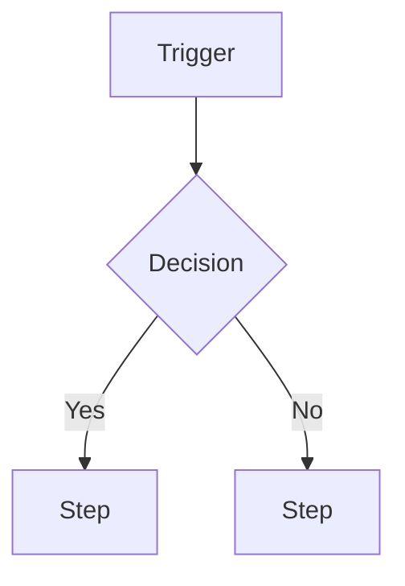

# Requirements Standards

Reference for Business Analyst artifacts — requirements specifications, traceability, and process flows. Use these templates whenever a skill produces or updates requirements content. Acceptance criteria always follow `standards/bdd.md`.

---

## Artifact Types

| Artifact | Purpose | Lives in |
|----------|---------|----------|
| **Requirements Specification** | Capture what the system must do (functional) and how well (non-functional), plus business rules | Confluence |
| **Traceability Matrix** | Prove every requirement maps to a need, a Jira issue, and a test | Confluence |
| **Process Flow** | Document current vs future state of a business process | Confluence |
| **User Story / Acceptance Criteria** | Buildable unit of work | Jira (see `standards/jira.md`) |

A requirement is not "done" until it is traceable: linked upward to a user need or business goal, and downward to a Jira issue and a test.

---

## Requirements Specification Template

```
# Requirements: [Feature or Area]

**Owner:** [name]  **Last reviewed:** [date]  **Status:** Draft | Active | Deprecated

[One-paragraph summary — the business problem and the scope of these requirements.]

## Background & Goals
[Why this work exists. Link to the decision record, opportunity, or stakeholder request.]

## Functional Requirements
| ID | Requirement | Priority | Source | Jira |
|----|-------------|----------|--------|------|
| FR-1 | The system shall [observable capability] | Must / Should / Could | [stakeholder / doc] | [KEY] |

## Non-Functional Requirements
| ID | Category | Requirement | Target |
|----|----------|-------------|--------|
| NFR-1 | Performance / Security / Accessibility / Availability | The system shall [quality] | [measurable target] |

## Business Rules
| ID | Rule | Rationale |
|----|------|-----------|
| BR-1 | [Constraint that must always hold] | [why] |

## Out of Scope
- [Explicitly excluded]

## Open Questions
| Question | Owner | Due |
|----------|-------|-----|
| ... | ... | ... |
```

- Use **shall** for binding functional requirements; one requirement per row, one testable behaviour each.
- Prioritise with **MoSCoW** (Must / Should / Could / Won't).
- Every functional requirement gets a stable ID (`FR-n`) so it can be referenced from the traceability matrix and Jira.

---

## Requirements Traceability Matrix Template

Links each requirement to the need it serves, the work that delivers it, and the test that proves it.

```
# Traceability: [Feature or Area]

| Req ID | Requirement | User need / business goal | Jira issue(s) | Verification (test / AC) | Status |
|--------|-------------|---------------------------|---------------|--------------------------|--------|
| FR-1 | [short] | [need or goal] | [KEY] | [test name or AC ref] | Not started / In progress / Verified |
```

- One row per requirement ID from the specification.
- Status reflects verification, not development — a requirement is `Verified` only when its test/AC passes.
- Orphan rows (no Jira issue, or no verification) are flags: surface them rather than leaving them blank.

---

## Process Flow Template

Document the process as a numbered actor/step flow, and a future state when proposing change. A mermaid diagram is welcome but the numbered flow is the source of truth.

```
# Process Flow: [Process Name]

**Actors:** [roles involved]  **Trigger:** [what starts the process]  **Outcome:** [end state]

## Current State
1. **[Actor]** — [action] → [result]
2. **[Actor]** — [decision: condition?] → [branch]
   - Yes → [step]
   - No → [step]

## Future State (proposed)
1. ...

## Changes & Impact
| Change | Affected actor | Benefit | Risk |
|--------|----------------|---------|------|
| ... | ... | ... | ... |
```

Optional diagram:


- Name decision points as questions; label every branch.
- Keep swimlane responsibility explicit by leading each step with the **actor**.

---

## What Goes in Jira vs Confluence

| Content | Where |
|---------|-------|
| The requirement statement, traceability, process flows | Confluence (these templates) |
| The buildable story + acceptance criteria | Jira (`standards/jira.md`, ACs per `standards/bdd.md`) |
| Real-time delivery status | Jira |

Do not duplicate acceptance criteria across both — the Jira issue is the source of truth for ACs; the matrix references them.

---

## Style Rules

- **One requirement, one row, one testable behaviour** — never bundle.
- **Stable IDs** (`FR-`, `NFR-`, `BR-`) so requirements survive renumbering and stay referenceable.
- **Flag ambiguity** — if a stakeholder input is unclear, record it as an Open Question, never invent the requirement.
- **Measurable NFRs** — "fast" is not a requirement; "p95 < 300ms" is.
- ACs are written in Given/When/Then per `standards/bdd.md` and live on the Jira issue.
